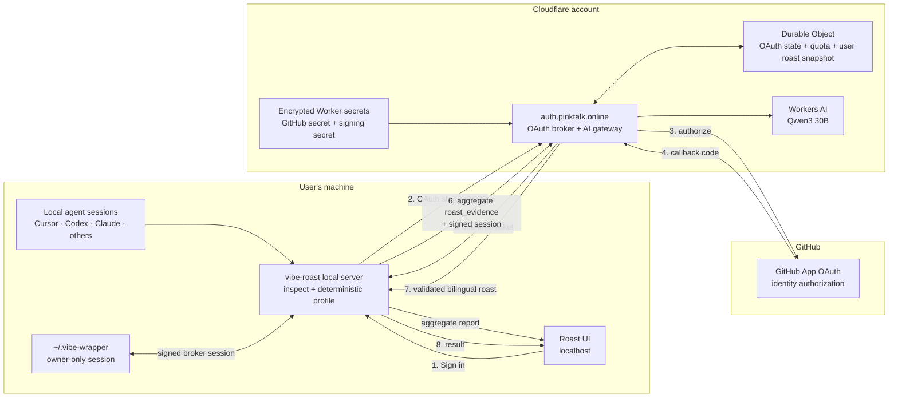

# Hosted Roast Architecture

Last updated: 2026-07-24

This document describes the public npm user's GitHub-authenticated, hosted-free
roast path. GitHub supplies identity only; Cloudflare Workers AI supplies model
inference.

## System diagram



## Request sequence

```mermaid
sequenceDiagram
    actor User
    participant UI as Local Roast UI
    participant Local as Local Node server
    participant Broker as Cloudflare Worker
    participant GitHub as GitHub OAuth
    participant AI as Workers AI / Qwen3

    User->>UI: Choose "Continue with GitHub"
    UI->>Local: Start login
    Local->>Broker: OAuth start (callback + PKCE)
    Broker->>GitHub: Redirect to authorization
    GitHub-->>Broker: Authorization code
    Broker->>GitHub: Exchange code using encrypted client secret
    GitHub-->>Broker: Verified GitHub identity
    Broker-->>Local: One-time ticket
    Local->>Broker: Redeem ticket
    Broker-->>Local: Signed, expiring broker session
    Local->>Local: Build aggregate-only roast_evidence
    Local->>Broker: POST /v1/chat/completions
    Broker->>Broker: Verify signature + compare user snapshot
    alt Materially unchanged
        Broker->>Broker: Load stored roast (no quota)
    else First roast or material change
        Broker->>Broker: Consume daily quota
        Broker->>AI: Fixed-model inference
        AI-->>Broker: Generated roast JSON
        Broker->>Broker: Store aggregate snapshot + roast by GitHub user
    end
    Broker-->>Local: OpenAI-compatible response
    Local->>Local: Validate bilingual JSON/schema
    Local-->>UI: Render roast; retain deterministic type
```

## Trust and privacy boundaries

- Raw local prompts and session files stay on the user's machine.
- The hosted request contains only `roast_evidence`: bounded aggregate signals,
  not raw prompts, filesystem paths, or environment configuration.
- GitHub OAuth proves account identity; it does not provide model quota.
- Cloudflare owns the shared free-tier quota and calls Workers AI through a
  fixed server-side model binding.
- The Durable Object stores one generated roast and a compact aggregate
  behavioral snapshot per GitHub identity. Stable-profile reads do not consume
  inference quota. The snapshot excludes raw prompts, paths, cumulative token
  totals, and local configuration.
- The GitHub client secret and broker signing secret never ship in the npm
  package. They remain encrypted Worker secrets.
- The local server stores only the signed, expiring broker session under
  `~/.vibe-wrapper/` with owner-only permissions.
- Deterministic type, axes, confidence, and dimensions cannot be changed by the
  LLM. Generated copy is accepted after bilingual JSON/schema validation and
  paragraph formatting. There is intentionally no post-generation semantic,
  grounding, or style audit; invalid structured output leaves the deterministic
  local roast available.

## Runtime endpoints

| Endpoint | Purpose |
| --- | --- |
| `https://auth.pinktalk.online/oauth/github/start` | Starts OAuth with PKCE |
| `https://auth.pinktalk.online/oauth/github/callback` | Receives GitHub's code |
| `https://auth.pinktalk.online/v1/chat/completions` | Authenticated AI gateway |
| `https://auth.pinktalk.online/health` | Non-secret deployment health |
